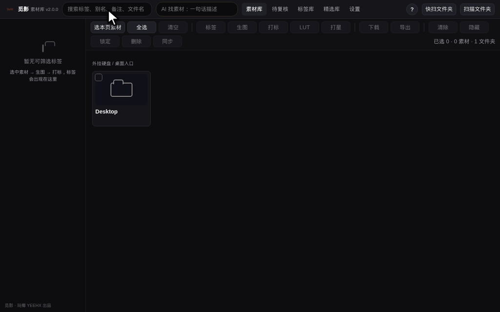

# 觅影 MiYing

**拍过的，都能轻松找到。**

本地运行的 AI 影视素材库 —— 让摄影师的素材家底真正可搜索、可调用、可复用：扫描硬盘 → AI 理解素材 → 用人话搜索 → 一键调用进剪辑。

由影像创作者 [玩椰](https://www.yeehx.com) 为自己十几 TB 的素材库而写。AI 时代应该知识平权——所以它开源，分享给每一个被素材淹没的创作者。

[官网下载](https://www.yeehx.com/miying) · [图文使用说明](docs/使用说明.md) · [更新日志](app/CHANGELOG.md)

---

## 它解决什么问题

十年素材散在七八块硬盘里，想找"那次在江边拍的日落航拍"，只能一块盘一块盘翻。觅影把这件事变成：

> 顶栏输入 **「武汉 江边 日落 航拍」** → 结果直接出来 → 选中 → 导出到剪辑工程，或在 Finder / 资源管理器里定位原片。

地标、颜色、天气、风格、氛围，都是能搜的维度。要剪一支《长江的颜色》？「紫色 长江」「金色 长江」「粉色 长江」逐个搜——只要拍到过，就能马上找到，哪怕是几年前拍的、记忆里只剩一个模糊印象的那段。

- **AI 看得懂画面**：接本地 Ollama 或任意 OpenAI 兼容 API，自动打标签、写描述；标签体系统一可控（参考库 + 别名 + 合并建议），不会越打越乱
- **像 Finder / 资源管理器一样浏览**：外挂硬盘直接进，每段素材一张代表帧、零延迟速览，一眼看清每段大概拍了什么；星级选片、键盘流操作
- **灰片 / RAW 一键还原色彩**：自动或手动匹配还原 LUT，log 灰片直接看到真实色彩，导出的底图不调色就能进 AI 用
- **原素材永远只读**：绝不重命名 / 移动 / 删除 / 改写任何文件；一切数据只写进自己的 `app/out/`，删掉即彻底卸载
- **离线优先**：全部在你自己的电脑上跑（macOS / Windows）。唯一的出站请求是启动时向官网查一次新版本号，设置里可关

## 适合谁

- **手里有素材家底、正在转型 AI 创作的摄影师**：多年积累的航拍、相机、电影机素材，是你区别于"不摄影的 AI 创作者"的最大财富。AI 越强，真实素材越值钱——觅影帮你把这份家底随时调用起来。
- **被素材淹没的剪辑师 / 导演**：不开剪辑软件，零延迟速览每段素材拍了什么；几年前那段记忆模糊的素材，一句话搜回来。
- **工程 / 团队里管素材的人**：按内容、地标、标签快速定位，导出清单（JSON / CSV / FCPXML / Premiere）直接交接。

## 下载前，先打消几个常见顾虑

- **「要在本地跑大模型吗？我电脑带不动吧？」** —— 不用。AI 理解素材推荐走云端 API：所有 AI 计算都发生在云端，你的电脑只要能开网页，就能跑觅影。本地 Ollama 只是给 M 系列芯片、在意隐私的人的可选项，不是必需。
- **「AI 要花多少钱？」** —— 用小米 MiMo 这类兼容 API，充 5 块、10 块钱就够打完一大库素材，没有订阅、没有月费。而且不配 AI 也能用：浏览、扫描、LUT 还原、手动标签、按词搜索全部可用。
- **「我的 Mac 很老了，行不行？」** —— 不挑机器。老 Intel Mac 一样跑，AI 走 API 模式就好。唯一要求：macOS + Python ≥ 3.10（没有会引导你装）。
- **「必须苹果电脑吗？」** —— 不用。macOS 和 Windows 10/11 都支持，同一个包：Mac 双击 `启动觅影.command`，Windows 双击 `启动觅影.bat`。

## 为 AI 创作而生

- **批量导出底图**：AI 图生视频要 20 张真实场景原图？过去得开剪辑软件逐条还原调色再导出；现在搜出来 → 全选 → 导出图片帧，一步完成。demo、初剪、AI 底图，够用且快。
- **让 Agent 替你选片**：觅影自带 MCP 接口，任何支持 MCP 的 AI 助手都能用人话指挥它——"找五段金色长江航拍，先发截图预览，选中的给原片"。原片太大就先回传截图。
- **全自动工作流的素材入口**：要搭"从选素材到成片"的 AI 影视流水线，"从真实素材里筛底图"这一环就是觅影。有真实输入的生成，比凭空生成真实、高效、准确得多。

## 快速开始

1. [下载 zip](https://www.yeehx.com/miying) 并解压（或 `git clone` 本仓库）
2. **macOS**：双击 `app/启动觅影.command`　·　**Windows**：双击 `app/启动觅影.bat`
   （首次会自动装依赖，约 1-5 分钟；之后秒开）
3. 跟着首跑向导走：选一块盘 → 快扫 → 开始用人话找素材

每一步都有图的保姆级教程：[图文使用说明](docs/使用说明.md)（软件里「关于觅影 → 图文使用说明」也能打开）。

> **macOS** 若提示"无法打开"：右键点击 `.command` 文件 → 打开 → 打开。只需要做一次。
> **Windows** 若弹 SmartScreen 蓝框：点「更多信息」→「仍要运行」。
>
> **系统要求**：macOS 或 Windows 10/11，Python ≥ 3.10（没有时启动脚本会引导安装；Windows 安装时勾选 "Add python.exe to PATH"）。
> Apple Silicon / Intel Mac 都支持；Intel Mac 与无独显 Windows 机器建议 AI 走 API 模式。

## AI 模型怎么选

| 方案 | 适合 | 说明 |
|---|---|---|
| 本地 Ollama | M 系列芯片 Mac、带独显 Windows、在意隐私 | 装 [Ollama](https://ollama.com) 拉一个视觉模型（推荐 Qwen3.6 A3B，24GB+ 内存更从容），完全免费、全程不出网 |
| OpenAI 兼容 API（推荐） | 任何 Mac / Windows、要省心 | 填地址 + Key（如小米 MiMo：注册 `platform.xiaomimimo.com`，地址填 `https://api.xiaomimimo.com/v1`），充 5-10 元就够打完一大库；AI 算力全在云端，电脑能开网页就行，12 路并发一晚上打完 |
| 先不配 | 只想先用起来 | 浏览 / 扫描 / LUT / 手动标签 / 按词搜索全部可用，AI 打标随时补 |

## 主要功能

浏览与选片（LUT 预览、星级、键盘流、大图 lightbox、换封面帧）；扫描与理解（快扫建底稿、精扫、同步对账增量更新、搬家识别、重复检测）；查找与调用（自然语言 AI 找、标签 / 星级 / LUT 筛选、全文搜索、导出复制、Finder / 资源管理器定位、手机局域网访问）；词表治理（类目管理、别名、合并建议、参考图、低频清理、备份还原）；以及 MCP 接口——可以把觅影接进支持 MCP 的 AI 助手，用对话管理素材库（见 `app/Hermes接入觅影.md`）。

## RED 与厂商 LUT

- **R3D 预览**：需自行安装 RED 官方 REDCINE-X PRO（含 REDline 解码），请到 RED 官网下载并遵守其许可；不装不影响 R3D 的登记与搜索。觅影不附带、不分发 RED 的任何软件组件
- **还原 LUT**：出于版权，发布包**不含**任何厂商 `.cube`。请到 DJI / Sony / RED 官方渠道免费下载，在设置页导入，仅用于个人学习与自有素材预览（详见 `app/luts/README.md`）；缺 LUT 时觅影不造假色，灰片保持灰片

## 隐私与安全

- 原素材只读是写进代码的铁律，所有写入只落 `app/out/`
- 默认只监听 `127.0.0.1`；手机访问需在设置里手动开启（带口令）
- 唯一出站请求：启动时 GET `yeehx.com/miying/version.json` 查新版本，设置可关
- API Key 只存在你本机 `app/out/model_settings.json`，不进代码仓库

## 关注玩椰

觅影是玩椰用爱发电的个人工具。觉得好用，去任一平台点个关注就是最好的支持：

| 平台 | 入口 |
|---|---|
| 抖音 | [@玩椰](https://v.douyin.com/vcq9jo-kBZ0) |
| B 站 | [玩椰](https://space.bilibili.com/371127301) |
| 视频号 / 公众号 | 微信搜「玩椰」，或扫下方二维码 |
| 官网 | [yeehx.com](https://www.yeehx.com) |

关注任一平台，第一时间获取新版本动态、使用技巧和视频教程。也可邮件联系：hi@yeehx.com

## 许可证

代码以 [AGPL-3.0](LICENSE) 开源：自由使用、修改、再分发；修改后对外提供服务须同样开源。

「玩椰」「YEEHX」「觅影」名称、签名标识与 logo **不在授权范围内**（详见 [NOTICE](NOTICE)）——fork 请改名并移除品牌资产。「YEEHX」为已注册商标。

贡献代码前请先开 issue 聊一下想法；提交 PR 即视为同意你的贡献以 AGPL-3.0 授权，并授权作者将其用于觅影的后续版本（含可能的商业版本）。

---

玩椰 YEEHX · 武汉 · 极尽创意 MAX CREATIVITY

