# 觅影使用说明（图文版）

> 拍过的，都能轻松找到。这份说明带你从解压到熟练，每一步都有图。
> 关注 抖音 / 视频号 / B站 **玩椰**，获取新版本动态和视频教程。

> 💡 **先放心**：觅影不需要你在本地跑大模型，也不挑电脑——AI 推荐走云端 API（小米 MiMo 充 5-10 元就够打完一大库），你的电脑能开网页就能跑。老 Intel Mac、无独显的 Windows 机同样没问题。

> ✅ **支持 macOS 和 Windows 10/11**（Apple Silicon 体验最佳；Intel Mac 和 Windows 都可用，AI 打标推荐走 API）。

**它能干什么（30 秒版）**

- **找**：十几 TB 素材一句话调出——地标、颜色、天气、氛围都能搜
- **看**：每段素材一张代表帧，零延迟速览整块硬盘
- **用**：批量导出原片 / 单帧底图 / 清单，不用开剪辑软件
- **接**：AI 助手可直接指挥觅影找素材、发原片（MCP）

---

## 一、安装启动（只做一次）

1. [下载 zip](https://www.yeehx.com/miying) 并解压，放到你顺手的位置（以后就在这里用，别放回收站边上）
2. 进入 `app` 文件夹：**mac 双击 `启动觅影.command`，Windows 双击 `启动觅影.bat`**
3. 第一次会自动安装依赖，**等 1-5 分钟**，之后每次都是秒开

> **mac 弹出"无法打开，来自身份不明开发者"？** 这是 macOS 的正常拦截：**右键点击** `启动觅影.command` → 选「打开」→ 再点「打开」。只需要做这一次，以后双击就行。
>
> **Windows 弹出 SmartScreen 蓝框？** 点「更多信息」→「仍要运行」，同样只需一次。没装 Python 的话脚本会自动打开下载页——安装第一屏记得勾选 **Add python.exe to PATH**，装完再双击一次。

**你需要准备的**（就两样）：

- 一台 Mac（Apple Silicon / Intel 都行）或 Windows 10/11 电脑
- Python ≥ 3.10 —— 没有的话启动脚本会检测并引导你安装，跟着提示走即可

**启动脚本会自动帮你装的**（不用你操心）：

- 全部运行依赖：Web 服务、图像处理、视频抽帧等所需的 Python 库
- 两个可选件：独立窗口（pywebview）、iPhone HEIC 照片支持——装不上会自动跳过，不影响任何核心功能
- 网络不畅时自动切换国内镜像重试，不会卡死在安装

**按需自己装的**（都可选，用到再装）：

- [Ollama](https://ollama.com)：本地免费 AI 打标（见第七节）
- RED 官网的 REDCINE-X PRO：看 R3D 原片用（见第十节）
- 各厂商官方还原 LUT：还原 log 灰片用（见第十节）

启动后会弹出觅影窗口（或浏览器页面），看到这个画面就成功了：

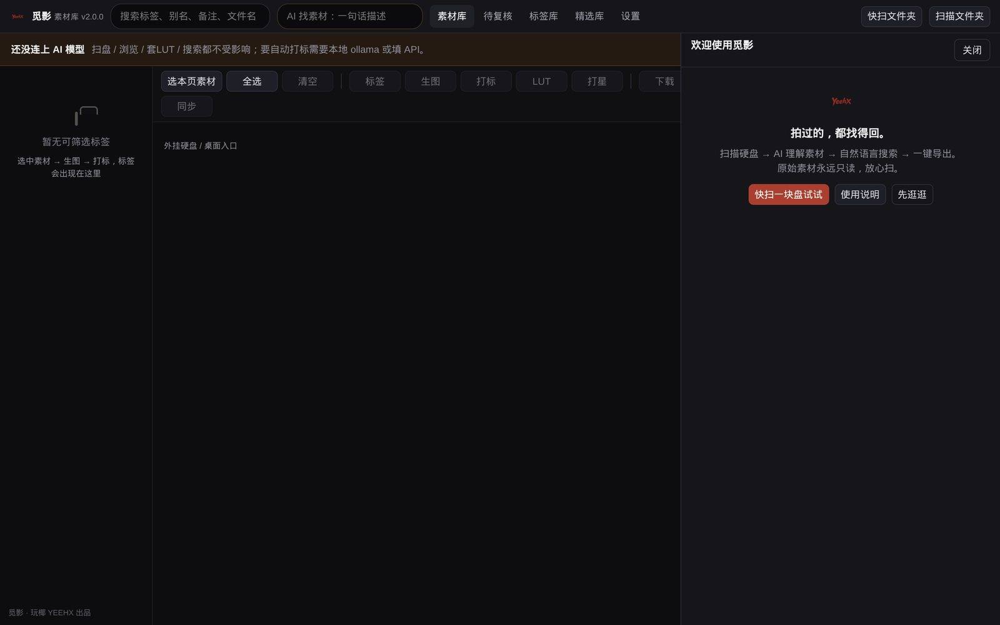

**关窗口 = 退出觅影**。想手动停：双击 `app/停止觅影.command`（Windows：`app/停止觅影.bat`）。

## 二、建库：快扫一块盘（第一次用必做）

素材要先"登记"才能被搜到。点右上角 **「快扫文件夹」** 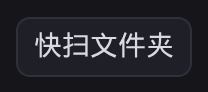 选一块硬盘或一个大文件夹。

快扫做三件事：登记素材 → 生成缩略图 → 建立可搜索底稿。几千条素材大约几分钟，进度条在页面右下角，期间可以正常使用。

### 觅影怎么理解素材（先懂这个，后面全顺）

觅影做的事，一句话：**让 AI 看懂你的素材库**——每段素材拍的是什么、有什么主体和地标、什么拍法，全部变成 AI 能理解的描述和标签。从此素材不只是你自己记得，你能用人话搜，任何 AI 助手（Agent）也能替你查找、调用（见第十一节）。

看懂一段素材要过三步，缺一不可：

1. **登记**：记下文件在哪、叫什么、多大——这一步 AI 还**看不见**画面
2. **生图**：抽一张代表帧做缩略图——这是 AI 的眼睛，没生图就没画面可看
3. **打标**：AI 看着代表帧，参考路径、文件名和元数据，写出描述、挂上标签——到这一步才算**看懂**

快扫会自动串完这三步（轻量版：每个文件夹抽 2 张代表图）。哪段素材"还没图""没打标"，选中它点「生图」「打标」随时补。

> 💡 **给 AI 递线索：文件夹名起好**。打标时 AI 会参考硬盘名、文件夹路径和文件名——`2024_黄鹤楼_航拍` 和 `新建文件夹(3)`，AI 的理解质量差一个量级。这条针对**以后归档新素材**；已入库的没必要特意改名（觅影绝不动你的文件；你自己改了名，觅影会当成素材搬家去重新对账，白折腾）。

> **放心扫**：原素材永远只读——觅影绝不重命名、移动、删除、修改你的任何文件。所有数据只写进 `app/out/` 这一个文件夹。
>
> **AI 打标**：连上模型后（见第七节）扫描会自动打标签；没连模型也能扫、能浏览、能按文件名搜，标签以后随时补。

从首跑向导到建起第一个可搜索的库，完整过程 30 秒看完：

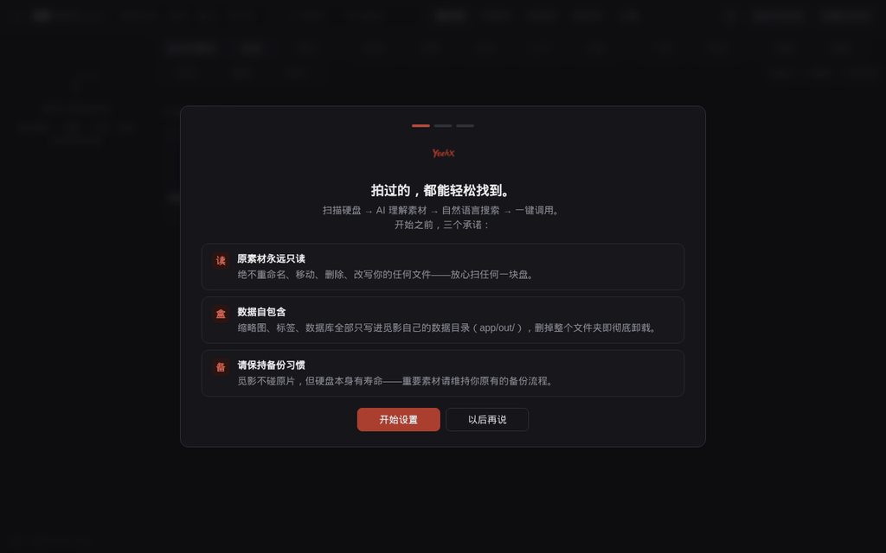

**快扫 vs 扫描的区别**：快扫每个文件夹只抽 2 张代表图，几分钟建起全盘底稿；重点文件夹再用 **「扫描文件夹」** 精扫——登记全部素材、补齐全部缩略图、逐一打标。实际操作长这样（选中文件夹 → 扫描文件夹 → 确认）：

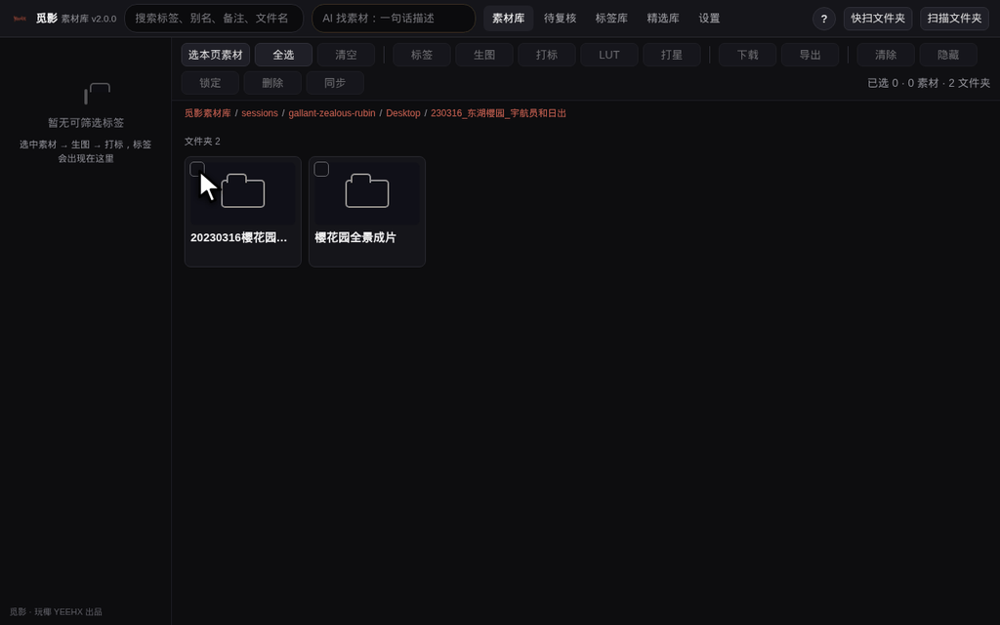

## 三、界面地图（30 秒认全）

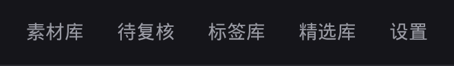

五个入口，各管一件事：**素材库**（浏览和找）、**待复核**（AI 提的新词，你确认了才进标签库）、**标签库**（所有标签的管理后台）、**精选库**（打过星的好素材）、**设置**（模型、类目、LUT、备份都在这）。

工具栏在选中素材后使用，每个按钮都有悬停说明：

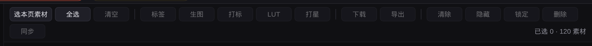

**四个核心动作，各干一件事、各有各的目的**：

- **快扫 / 扫描**：把素材"登记"进库。快扫抽样建底稿（快），扫描全量精整理（细）——没登记的素材，觅影不知道它存在
- **生图**：生成代表帧缩略图。它是后面一切的基础——**速览**靠它认出素材、**打标**靠它给 AI 看、**导出静帧**直接取它
- **打标**：让 AI 看图写标签和描述。打完标，素材才能被"人话"搜到，Agent 调用时才知道"这段拍的是什么"
- **同步**：硬盘后来又拍了新素材？一键增量对账——新增的补进来，打过的不重打

## 四、找素材：三种方式

### 1. 直接搜（最常用）

顶栏搜索框 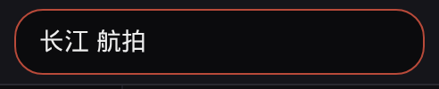 输入关键词，回车。标签、别名、备注、文件名、AI 描述都能命中。地标、颜色、天气、风格、氛围随意组合——比如 `长江 航拍`：

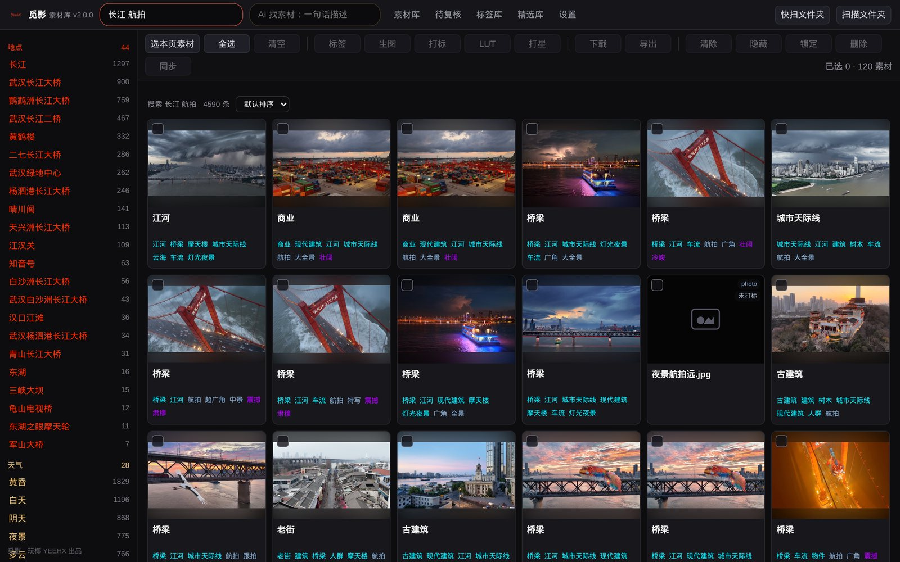

要剪一支《长江的颜色》？就挨个搜 `紫色 长江`、`金色 长江`、`粉色 长江`——只要拍到过，就能找到。

### 2. 左侧标签筛选

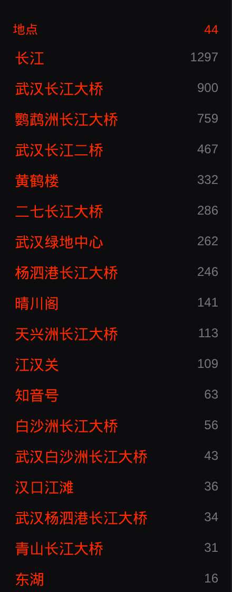

按类目点选，多个标签叠加收窄。搜不准的时候，点标签最可靠。

### 3. AI 找素材（金框，一句话）

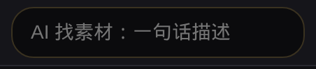

用人话描述，还能直接带导出指令：

> 在 02_视频 里找武当山雪景航拍空镜，导出到桌面武当山备选

AI 会把这句话解析成 范围 + 标签组合 + 关键词，先给你看结果和"AI 理解"，**导出必须经你确认才执行**。要调用模型，慢几秒正常，Esc 可取消。

> AI 只有两个权限：搜索（只读）和导出（复制）。它没有任何能动你原始素材的通道。

## 五、看片、选片

最基础的两个动作：**点缩略图看大图，点卡片标题看详情**——

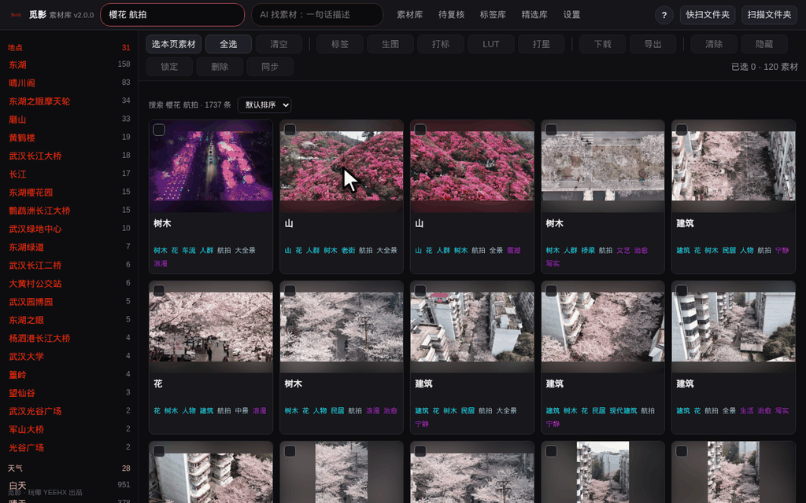

**点缩略图** = 全屏大图，`←` `→` 翻页，`1-5` 打星，`0` 取消星，`Esc` 关闭：

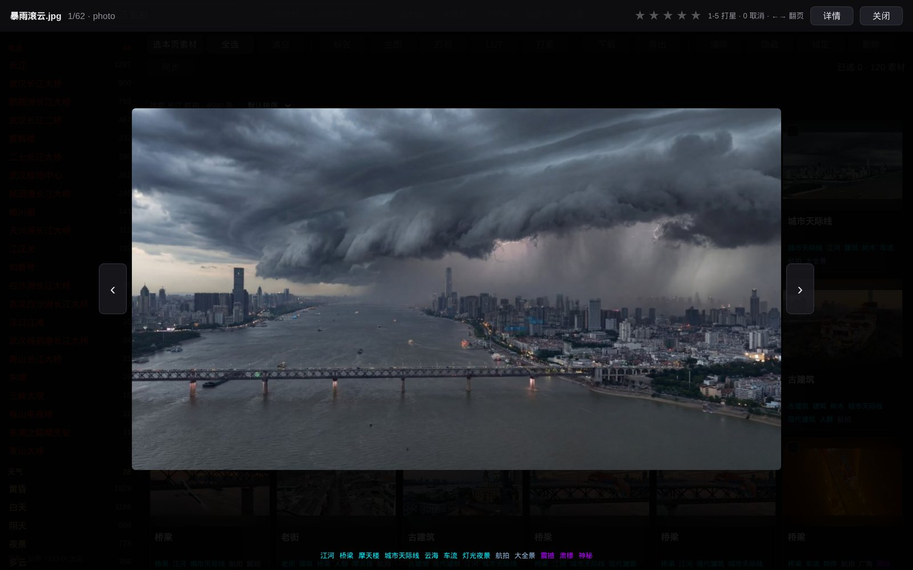

**点卡片标题** = 详情抽屉：改备注、调标签、打星、「在 Finder / 资源管理器中显示」定位原片：

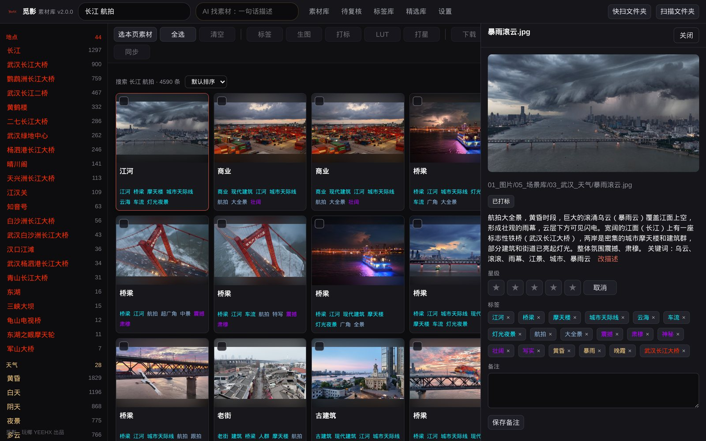

键盘流：方向键移动 · 空格选中 · 回车大图 · `I` 详情 · `A` 全选 · Shift+勾选范围多选。打过星的素材都在 **精选库**。

## 六、拿走素材：导出

勾选素材（点卡片左上角 ✓ 角标），点工具栏 **「导出」** 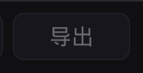：

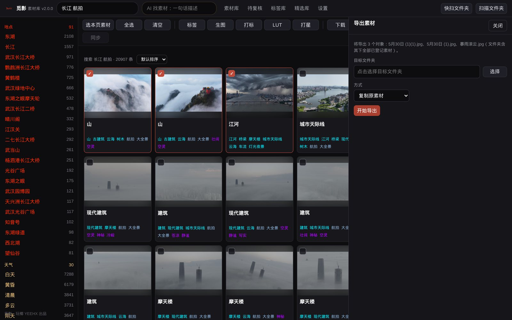

三种方式，对应三种用途：

1. **复制原素材** —— 进剪辑工程用原片
2. **导出图片/帧** —— 每条视频取封面那一帧存成图片。**这是给 AI 喂底图的神器**：要 20 张真实场景原图做图生视频？搜出来 → 全选 → 导出图片帧，不用开剪辑软件
3. **清单** —— JSON（给 AI/脚本）、CSV、TXT 路径、Premiere、FCPXML（Final Cut Pro）

导出永远是"复制"，原素材原地不动。导出图片帧的真实成果长这样——直接就是能喂给 AI 的底图：

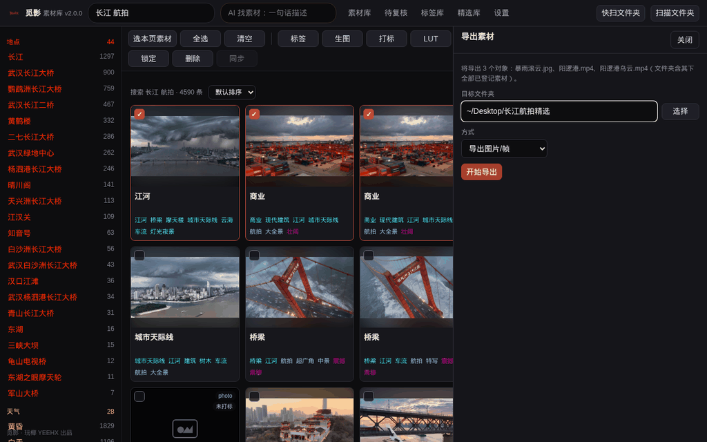

## 七、AI 模型：连不连、怎么连（保姆级）

不连模型：扫描、浏览、LUT、手动标签、按词搜索全部可用。连上模型：自动打标 + AI 找素材才会工作。设置 → AI 模型，两张卡片二选一：

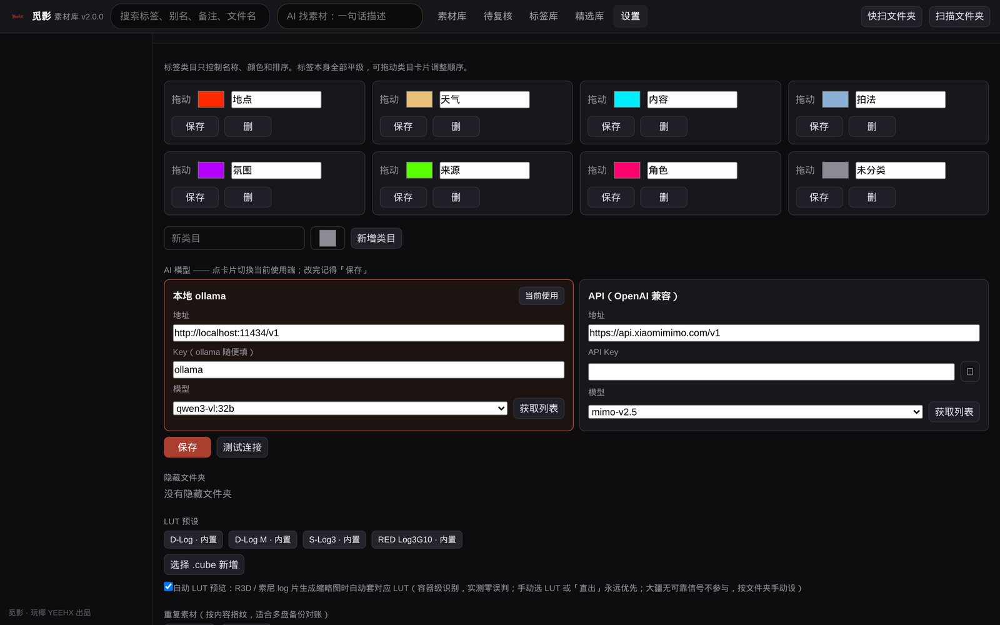

### 路线 A：本地 Ollama（完全免费，全程不出网）

1. 打开 [ollama.com](https://ollama.com) 下载对应系统版本，安装后启动（mac 菜单栏 / Windows 托盘出现小羊驼图标即在运行）
2. 拉一个视觉模型。**推荐 Qwen3.6 A3B**——MoE 架构只激活小部分参数，速度快、打标效果稳：在 [ollama.com/library](https://ollama.com/library) 搜 `qwen3.6` 选 A3B 视觉版，把页面给出的 `ollama pull ...` 命令粘进「终端」执行（模型十几 GB，下载要一会儿）
3. 回到觅影：设置 → AI 模型 → **本地卡片**：地址默认 `http://localhost:11434/v1` 不用改 → 点「获取列表」选中刚拉的模型 → 「测试连接」→ 「保存」

> **硬件参考**：Apple Silicon 统一内存 16GB 起步（跑小一点的视觉模型），跑 Qwen3.6 A3B 建议 **24GB 及以上**；Windows 本地跑建议 NVIDIA 独显 12GB+ 显存。Intel Mac 和无独显 Windows 机不建议本地跑大模型，直接走路线 B。

### 路线 B：小米 MiMo API（速度王者，多线程并发打标）

1. 浏览器打开 **platform.xiaomimimo.com**，用小米账号登录（没有就注册一个）
2. 在控制台创建 **API Key**，复制保存好（通常只完整显示一次）。官方不定期有**免费 Token 激励计划**，额度和申请方式以官网当期政策为准
3. 回到觅影：设置 → AI 模型 → **API 卡片**：地址填 `https://api.xiaomimimo.com/v1` → 粘贴 Key → 模型填 `mimo-v2.5` → 「测试连接」→ 「保存」

> **为什么快**：API 模式下觅影自动开 **12 路并发**打标，几千条素材的库一晚上就能全部打完；本地模式一条一条来，胜在免费和绝对隐私。两条路线随时可切，已打过的标不会重打。

「测试连接」只探活不保存，点「保存」才生效。Key 只存在你本机 `app/out/model_settings.json`，不会上传。

连好模型后，一个完整的"让 AI 认识素材"流程长这样：刚登记的素材只是空占位 → **全选 → 生图**（任务队列生成缩略图，先"看得见"）→ **打标**（AI 看图写标签写描述，队列自动跑）→ 打完点开任意素材，就能看到 AI 的描述和标签：

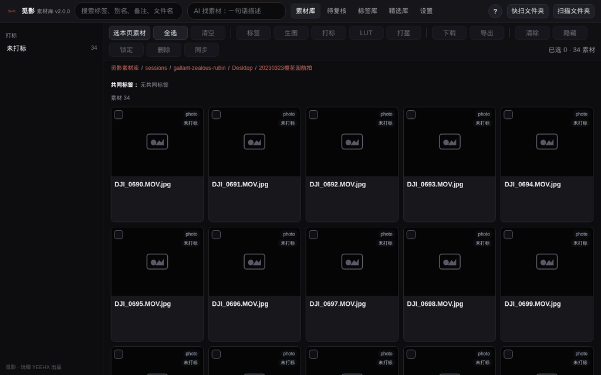

一句话记住这两步的目的：**生图是为了看得见，打标是为了搜得到、Agent 读得懂**。已打过的不会重打，放心整夹操作。

## 八、AI 提的新词：待复核

**先说清楚：待复核不是 AI 拿不准，你也不欠它一个个处理。** AI 已经给每段素材写好了完整描述和标签；待复核是**标签库的准入关**——AI 提出的新词（一个大库能提几千个）你点「同意加入」才收录为正式标签，带置信度、出处素材和理由（同义词可直接并入别名），所以标签库不会越用越乱。**全部拒绝也不影响搜索**：AI 描述已经进了全文搜索，这些词照样能搜到对应素材；正式标签的价值是侧栏筛选、统一管理、挂参考图。留下常用的，其余放心拒绝：

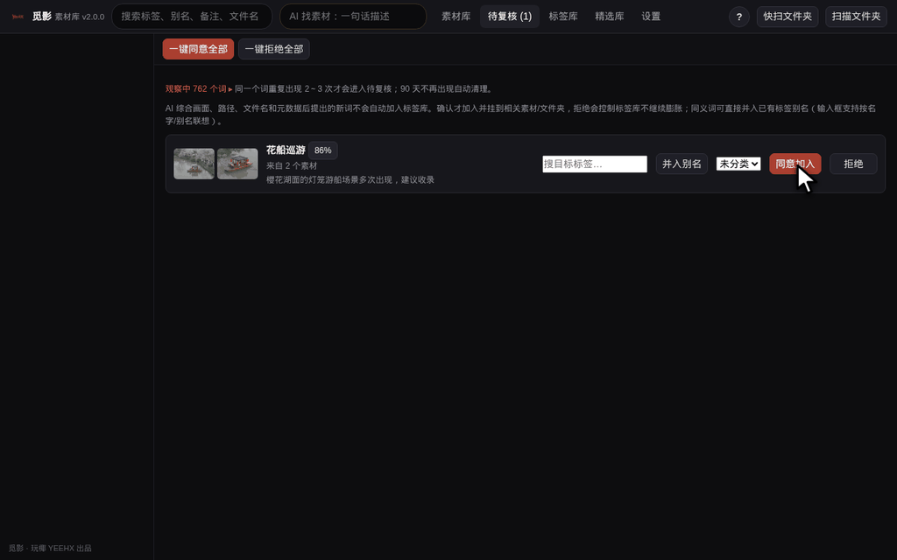

手动挂标签同样简单：选中素材 → 工具栏「标签」→ 点选 → 确定：

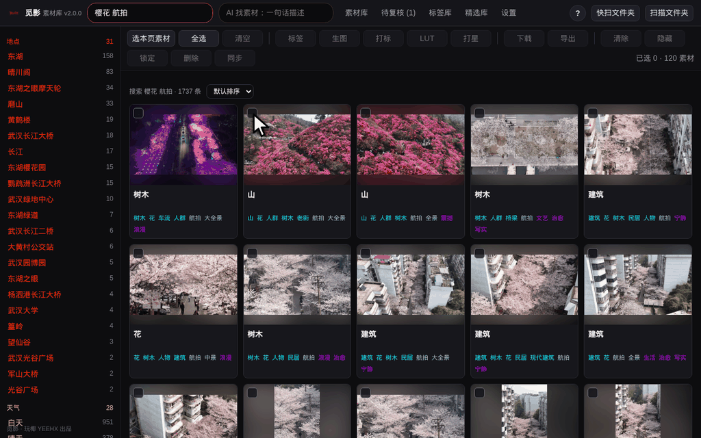

标签库页面可以拖拽换类目、拖到另一个标签上合并、让 AI 给整理建议：

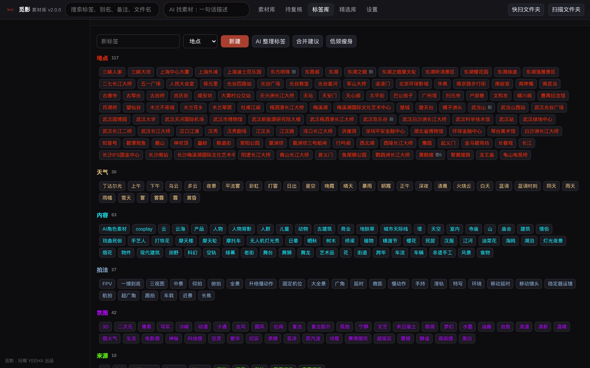

## 九、硬盘后来又拍了新素材？点「同步」

选中那块盘（或文件夹），点工具栏 **「同步」** 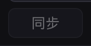。它做双向对账：新增的入库并打标、已打标的**不会重打**、消失的清掉库记录。可以放心反复点。

文件改名、移动了也不怕：觅影认内容指纹，重新扫到新位置后，旧的标签、星级、缩略图自动跟过去。

## 十、LUT：灰片一键还原（RED / 大疆 / 索尼）

拍 log 的都懂：满硬盘灰片，缩略图全是一片灰，根本没法选片。觅影里：选中素材（或整个文件夹）→ 工具栏 **「LUT」** → 选还原预设 → 确认，缩略图批量重渲染成正常色彩——**只改预览，绝不动原片**：

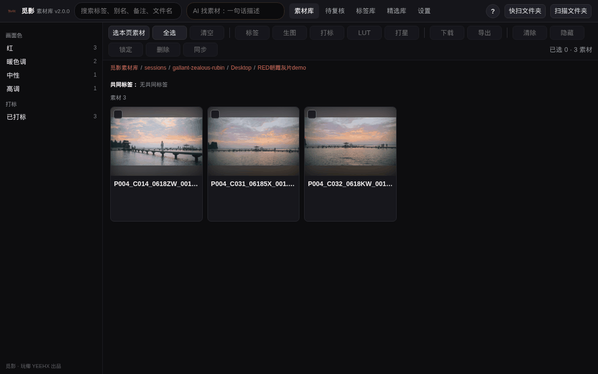

- **自动 LUT**：设置页开启后，扫描时按文件名/机型线索自动识别 log 素材并套还原 LUT，灰片进库即彩色；识别不了或想换风格，随时手动改
- **版权说明**：发布包**不含**任何厂商 LUT。请去官方渠道免费下载（DJI 官网下载中心的 D-Log/D-Log M 还原 LUT、Sony 专业站的 S-Log3 还原 LUT、RED 官网的 IPP2 LUT 包），在 设置 → LUT 预设 → 「选择 .cube 新增」导入，仅用于个人学习和自有素材预览。详见 `app/luts/README.md`
- **RED（R3D）用户注意**：预览 R3D 原片需要安装 RED 官方 **REDCINE-X PRO（含 REDline）**，去 RED 官网下载并遵守其许可；不装不影响 R3D 的登记和搜索，只是没有缩略图。觅影不附带 RED 的任何软件组件

## 十一、接入 AI 助手（进阶，但值得）

觅影自带 MCP 接口。把它接进任何支持 MCP 的 AI 助手后，你可以直接对 AI 说：

> 帮我找五段金色长江的航拍，先发截图我看看 → 第 2、4 段可以，原片发我

AI 助手会调用觅影完成搜索、回传预览、发送原片、导出底图——这就是"摄影师 AI 工作流"里筛选真实素材的那一环。接入方法见 `app/Hermes接入觅影.md`。

## 常见问题

**升级新版本，我的库会丢吗？** —— 不会。从 v2.1.1 起：下载新版解压 → 双击新文件夹的启动脚本，觅影会自动发现旧文件夹里的素材库并提示**一键搬家**（标签、星级、设置全保留，不用重扫）。确认没问题后旧文件夹可删。万一没自动发现，手动把旧文件夹的 `app/out` 整个拷进新文件夹的 `app/` 下即可。

**下载到的还是旧版本？** —— 先刷新下载页再点下载，认准下载文件名里的版本号。从 v2.1.1 起，就算旧版还在后台运行，双击新版启动脚本也会自动停旧换新，不会再「打开还是旧版」。

**双击启动没反应 / 提示无法打开** —— 右键 → 打开 → 打开（见第一节）；还不行就看 `app/out/app.log` 最后几行，通常最后一行就写着原因。

**页面顶上有条黄字"还没连上 AI 模型"** —— 不影响使用，想要 AI 打标就照第七节连模型，不想看点「不再提示」。

**搜不到某段素材** —— ① 确认那块盘扫过；② 换左侧标签筛选试试；③ 看素材详情：没缩略图先「生图」（AI 看不见画面就理解不了），没打标再点「打标」。

**硬盘显示离线** —— 盘没插。插上就恢复，离线期间记录绝不会被误删。

**R3D 素材没有缩略图** —— 需要安装 RED 官方 REDCINE-X PRO（含 REDline 解码工具），装好后选中素材点「生图」即可。

**灰片套了 LUT 还是灰的** —— 检查对应的官方 .cube 是否已导入（设置 → LUT 预设）；缺文件时觅影不会"造假色"，宁可保持灰片。

**一个文件夹几十张连号照片，怎么只显示一条素材** —— 这是延时序列折叠：同前缀连号图片 ≥ 30 张会自动合并成一条"延时"素材（取中间帧做封面），避免延时序列刷屏。阈值可在 `app/config.yaml` 的 `timelapse_min_frames` 调整。

**手机上能用吗** —— 能。设置 → 手机/局域网访问，开启后用给出的带口令地址在手机浏览器打开（同一 WiFi）。首次开启时系统会弹防火墙确认：mac 点「允许」，Windows 勾「专用网络」→「允许访问」。

---

## 关于觅影

觅影是影像创作者 **玩椰** 为自己十几 TB 素材库写的工具，开源分享——AI 时代应该知识平权。

觉得好用，任一平台点个关注就是最好的支持：**抖音 / B站 / 视频号 / 小红书 / 微博 搜「玩椰」** · 官网 [yeehx.com](https://www.yeehx.com) · 合作 hi@yeehx.com

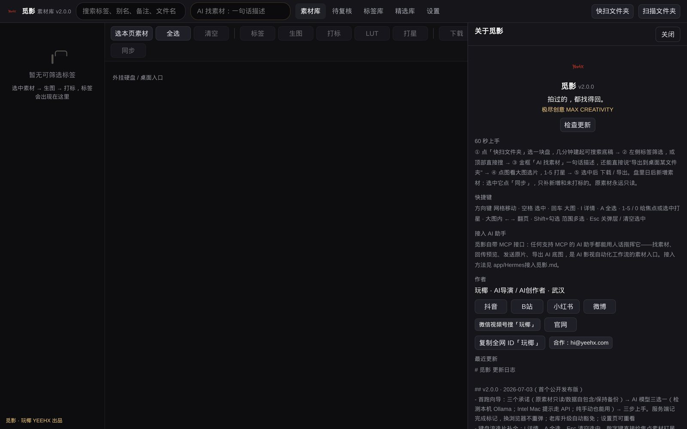
